# rimzone_shop

Projet e-commerce flutter framwork.

## Description

Ce projet est crée pour gérer une magazine en ligne il est composé de deux parties :

Partie Utilisateur:

- Créer un compte
- Voir les produits diffusé par la magazine
- Selectionner un produit
- Faire une commande sur espèce ou à distant
- Ajouter l'adresse de livraison via la carte maps
- Payer sur espèce ou à distant
- Voir les commandes livré, rejeté, en attente

## Demonstration
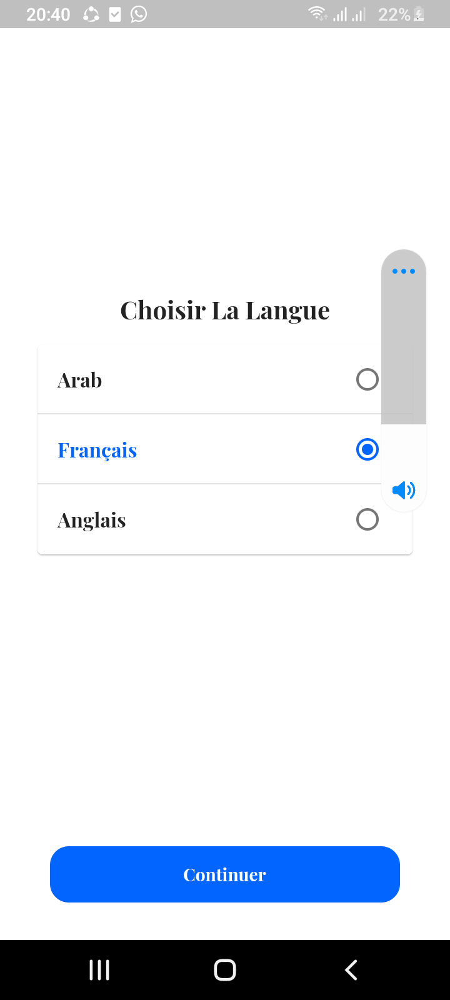
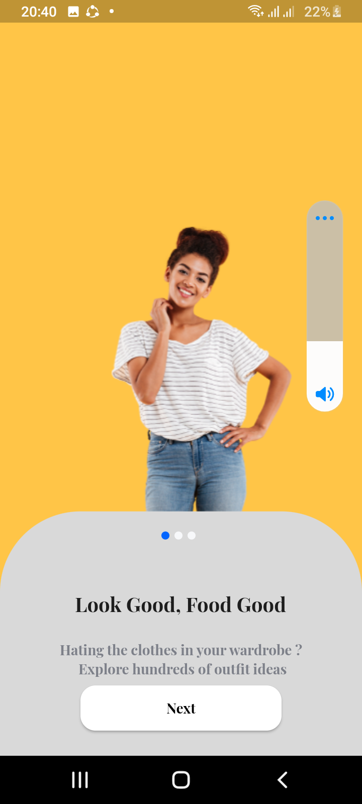
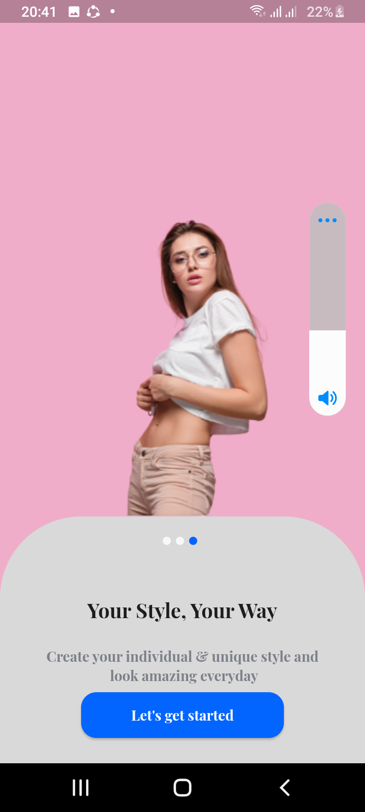
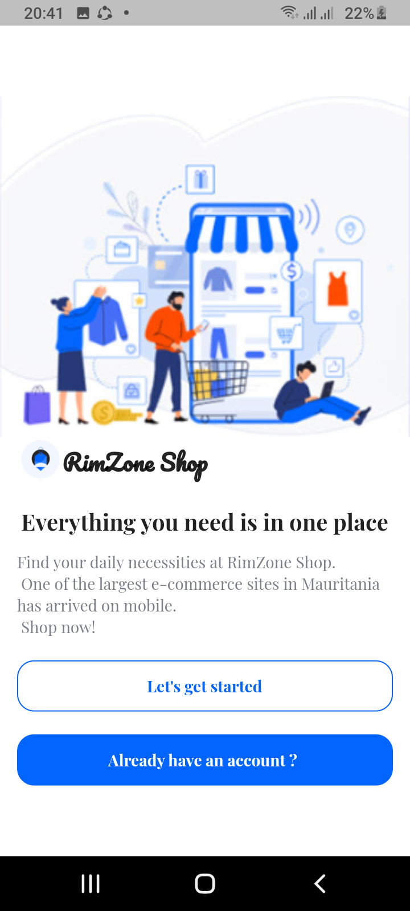
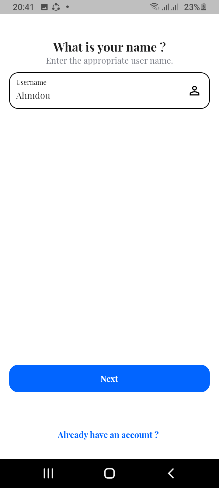
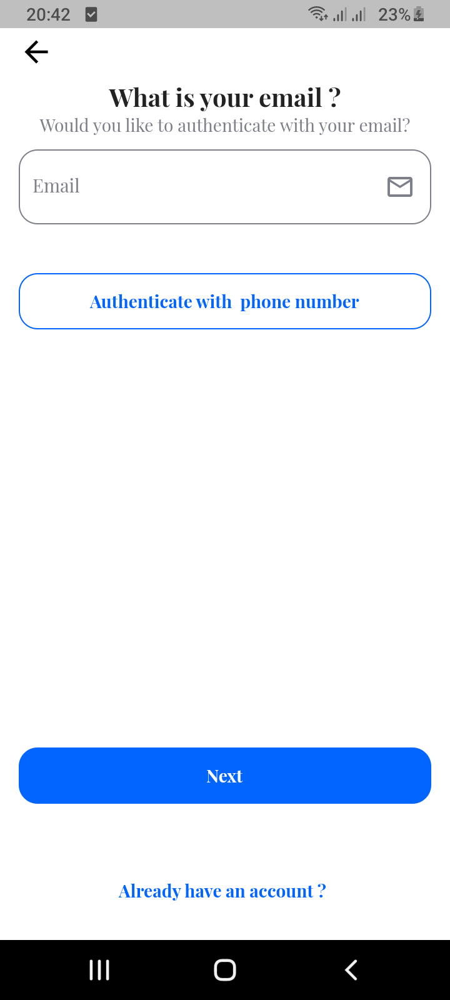
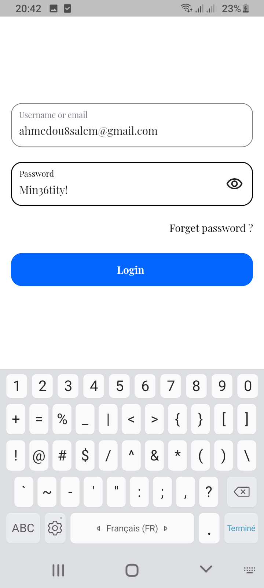
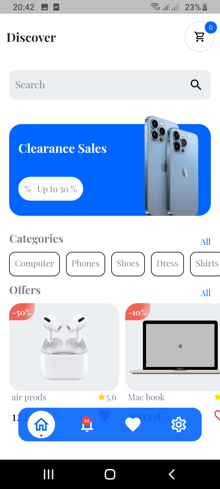
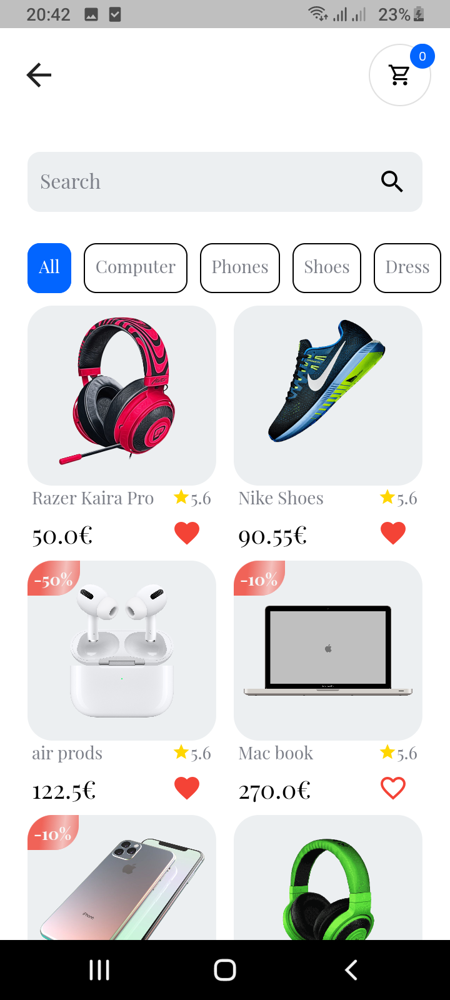

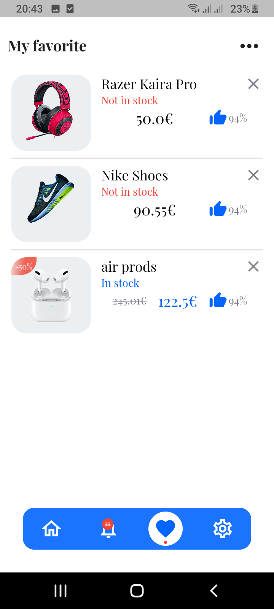
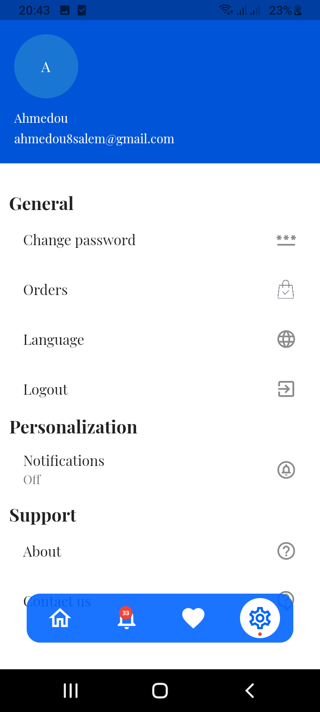

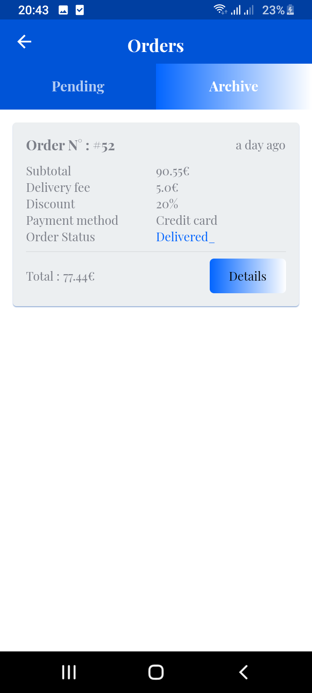
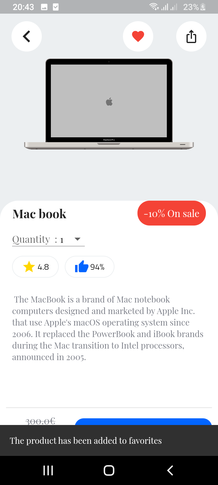
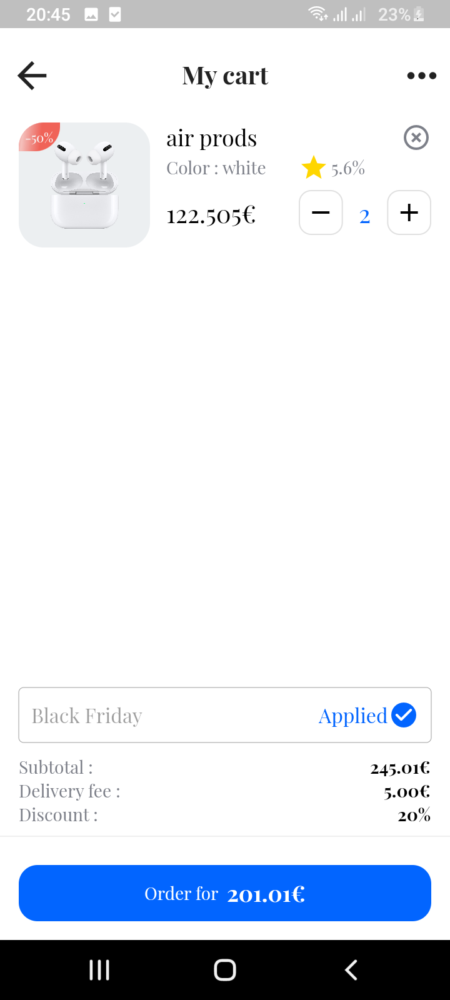
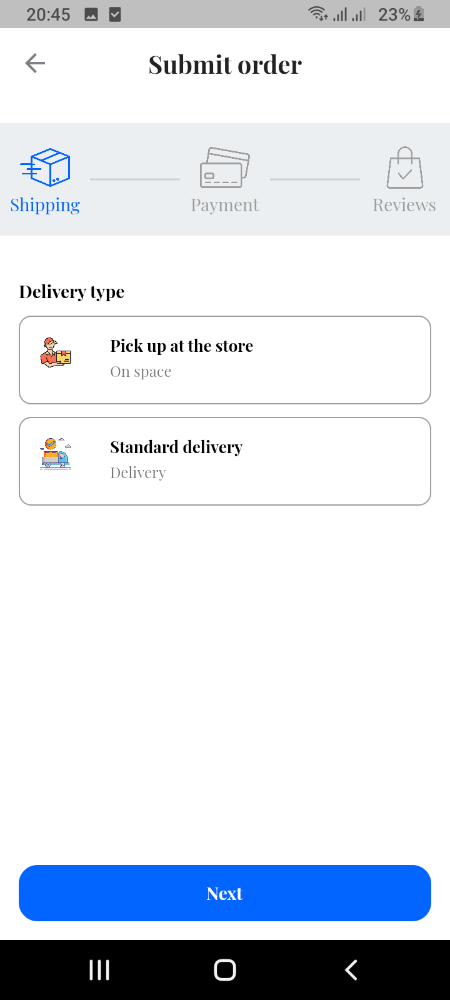
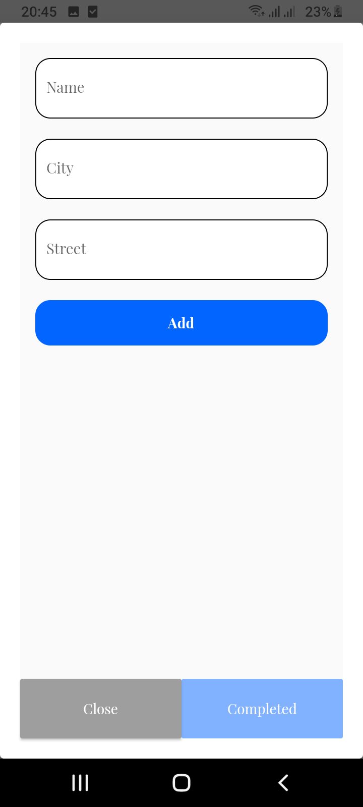
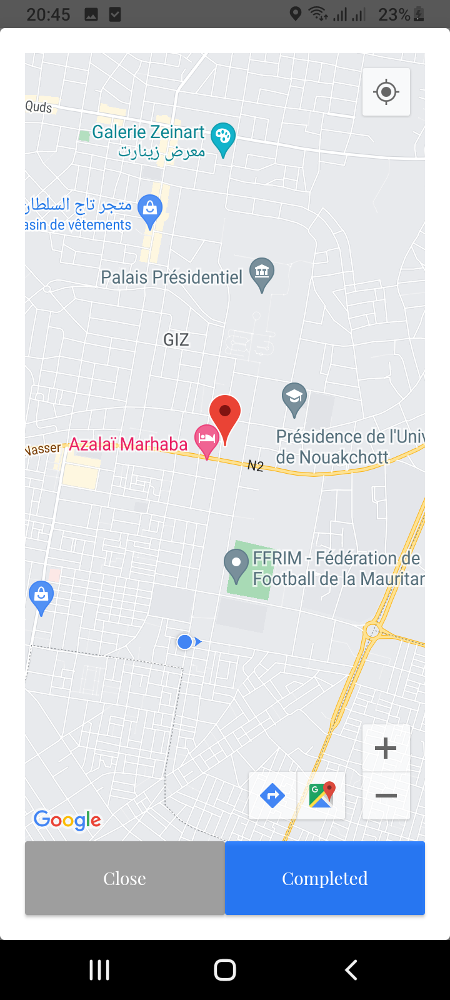
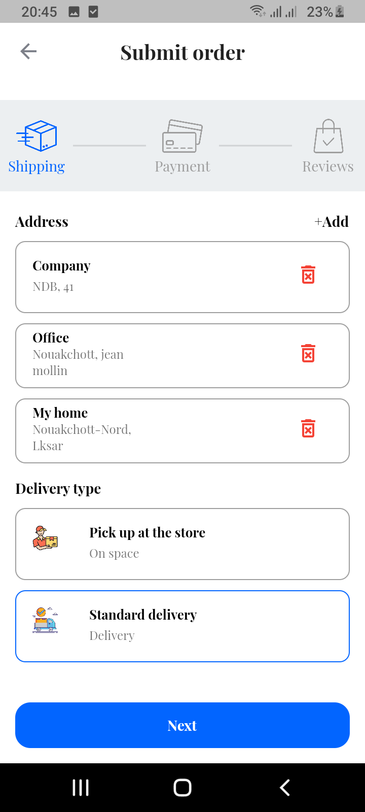
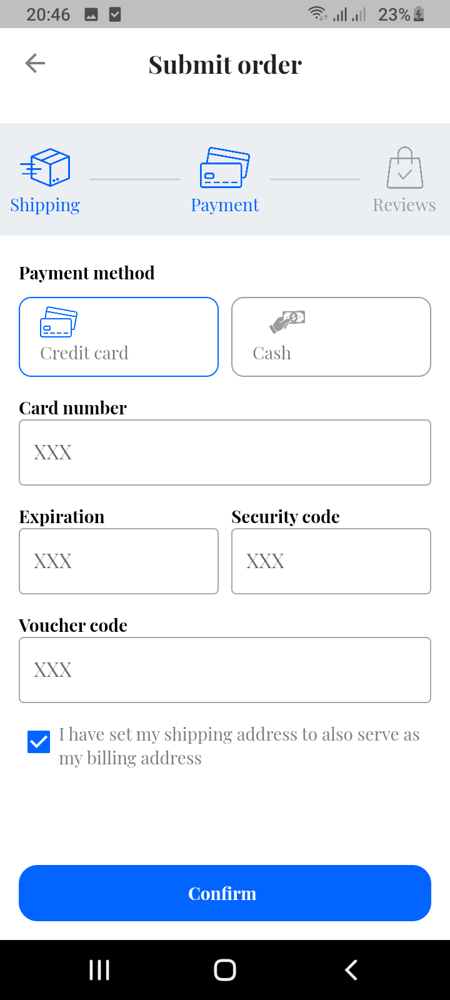
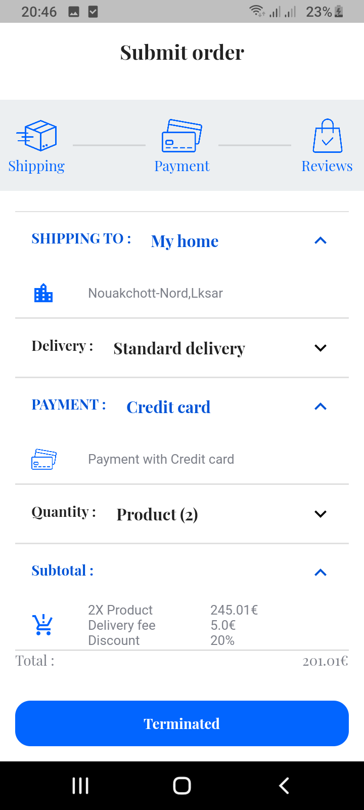
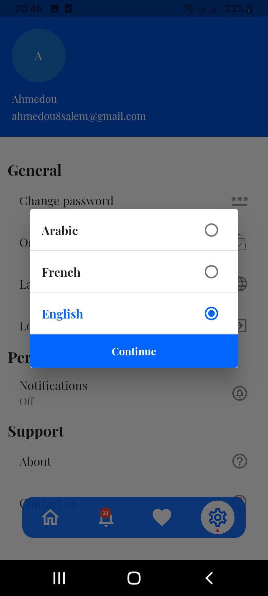
